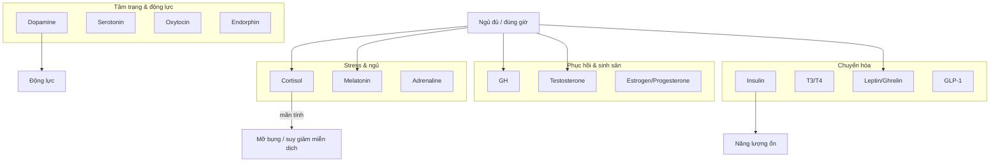

# 🧬 Endocrine Hormone Map — Bản đồ Hệ nội tiết

> [← Well-being](../well-being/README.md) | [Health OS](./health-os-overview.md) | [Personal tracking](../../../personal/README.md)
>
> **Loại tài liệu:** Map / Hub (tóm tắt hệ thống + hướng tối ưu + link deep-dive)  
> **Last Updated:** August 2026

<!-- agent-summary -->
**Agent SUMMARY:** Symptom → hormone triage table (§1) → mermaid clusters → per-hormone cards. Mỗi `*-system.md` có khung: bản chất sinh học → khái niệm → vai trò → lúc tăng → lúc giảm → ưu → nhược → sinh hóa đời sống → đòn bẩy. Playbook = checklist. Not a diagnosis guide.
<!-- /agent-summary -->

Hệ nội tiết điều khiển phần lớn chức năng sinh lý: năng lượng, tâm trạng, giấc ngủ, cân nặng, phục hồi và sinh sản. Doc này là **bản đồ tổng** — không thay lab/bác sĩ. **Mỗi hormone một bài `*-system.md`.** Khi cần đi sâu, nhảy sang file của đúng chất.

---

## 🗺️ 1. Bản đồ nhanh (chọn hormone theo triệu chứng)

| Bạn đang gặp | Hormone liên quan trước | Đọc tiếp |
| --- | --- | --- |
| Mất động lực, doomscroll | Dopamine | [dopamine-system.md](./dopamine-system.md) |
| Lo âu, thèm ngọt, mất ngủ | Serotonin · Cortisol · Melatonin | [serotonin](./serotonin-system.md) · [cortisol](./cortisol-system.md) · [melatonin](./melatonin-system.md) |
| Cô độc, khó tin, chỉ sống online | Oxytocin | [oxytocin-system](./oxytocin-system.md) |
| Không có mood-lift sau tập / chase đau | Endorphin | [endorphin-system](./endorphin-system.md) · [movement](./movement-protocols.md) |
| Crash sau ăn, đói liên tục | Insulin · Ghrelin · Leptin · GLP-1 | [insulin](./insulin-system.md) · [ghrelin](./ghrelin-system.md) · [leptin](./leptin-system.md) · [glp1](./glp1-system.md) |
| Stress kéo dài, mỡ bụng | Cortisol | [cortisol-system](./cortisol-system.md) |
| Khó ngủ / jet-lag lối sống | Melatonin · Cortisol | [melatonin-system](./melatonin-system.md) · [sleep](./sleep-optimization.md) |
| Yếu drive, khó build cơ | Testosterone · Sleep · Cortisol | [testosterone-system](./testosterone-system.md) |
| Phục hồi kém, tập mãi không lên | GH · Sleep · Protein | [growth-hormone-system](./growth-hormone-system.md) · [sleep](./sleep-optimization.md) |
| Huyết áp / giữ nước / đi tiểu nhiều khi uống rượu | Aldosterone · ADH · Adrenaline | [aldosterone](./aldosterone-system.md) · [adh](./adh-system.md) · [adrenaline](./adrenaline-system.md) |

---

## 😊 2. Nhóm Tâm trạng & Động lực (“hạnh phúc” + gắn kết)

### Dopamine — động lực & phần thưởng
- **Vai trò:** Muốn chinh phục mục tiêu, tập trung, “click” vui khi hoàn thành.
- **Thiếu (dấu hiệu lối sống):** Giảm động lực, mệt, hay quên, khó bắt đầu.
- **Tối ưu:** Chia nhỏ mục tiêu; tập luyện; ngủ đủ; giảm dopamine rẻ (SNS/game vô độ).
- **Deep-dive:** [dopamine-system.md](./dopamine-system.md)

### Serotonin — cân bằng cảm xúc
- **Vai trò:** Bình yên, ổn định mood, hỗ trợ ngủ.
- **Thiếu:** Lo âu, khí sắc thấp, thèm ngọt, mất ngủ.
- **Tối ưu:** Nắng sáng 15–30 phút; đi bộ; thực phẩm giàu tryptophan (trứng, hạt, cá hồi).
- **Deep-dive:** [serotonin-system.md](./serotonin-system.md) · [neurotransmitters-guide.md](./neurotransmitters-guide.md) (sinh hóa)

### Oxytocin — gắn kết xã hội
- **Vai trò:** Tin tưởng, đồng cảm, kết nối.
- **Tối ưu:** Tiếp xúc xã hội chất lượng, ôm người thân (nếu phù hợp), thú cưng, cộng đồng thật (không thay bằng tương tác farm online).
- **Ghi chú:** Không có “hack” đơn độc — phụ thuộc quan hệ và an toàn cảm xúc.
- **Deep-dive:** [oxytocin-system.md](./oxytocin-system.md)

### Endorphin — giảm đau / runner’s high
- **Vai trò:** Giảm cảm nhận đau, hưng phấn sau vận động cường độ hoặc cười lớn.
- **Tối ưu:** Tập có nhịp thở khó vừa phải → HIIT/interval; tránh dùng đau để “chase high” khi đang chấn thương.
- **Deep-dive:** [endorphin-system.md](./endorphin-system.md)

---

## 😰 3. Nhóm Căng thẳng & Giấc ngủ

### Cortisol — stress thích ứng
- **Vai trò:** Phản ứng nguy hiểm; điều hòa huyết áp & đường huyết (ngắn hạn cần thiết).
- **Dư thừa kéo dài:** Mỡ bụng, miễn dịch yếu, HA cao, kiệt thần kinh.
- **Tối ưu:** Thiền/hít thở; yoga; cắt thức khuya; ánh sáng sáng sớm + tối tối.
- **Deep-dive:** [cortisol-system.md](./cortisol-system.md) · cặp nhịp: [cortisol-melatonin-system.md](./cortisol-melatonin-system.md)

### Melatonin — nhịp ngày/đêm
- **Vai trò:** Tín hiệu “đêm” → ngủ sâu hơn khi điều kiện đúng.
- **Rối loạn:** Khó ngủ, nông giấc, mệt ban ngày.
- **Tối ưu:** Tắt/blue-light thấp ~1h trước ngủ; phòng tối, mát; giờ ngủ ổn định.
- **Deep-dive:** [melatonin-system.md](./melatonin-system.md) · [sleep-optimization.md](./sleep-optimization.md)

### Adrenaline / Noradrenaline — chiến-hay-chạy
- **Vai trò:** Tim nhanh, thở nhanh, máu dồn cơ — phản ứng tức thì.
- **Lạm dụng lối sống:** Caffeine + deadline liên tục → “nền” kích thích cao, khó xuống cortisol/melatonin buổi tối.
- **Tối ưu:** Phân biệt stress cấp (hữu ích) vs kích thích mạn; cooldown tối (không doomscroll tin nóng).
- **Deep-dive:** [adrenaline-system.md](./adrenaline-system.md) · [noradrenaline-system.md](./noradrenaline-system.md)
- **Acute brake (SNS × cortisol):** [sns-cortisol-brake-playbook.md](./sns-cortisol-brake-playbook.md)

---

## 🔥 4. Nhóm Chuyển hóa & Năng lượng

### Insulin — kiểm soát glucose
- **Vai trò:** Đưa glucose vào tế bào làm nhiên liệu/ dự trữ.
- **Mất cân bằng / kháng insulin (dấu hiệu):** Mỡ bụng, thèm ăn thường xuyên, nguy cơ T2DM lâu dài.
- **Tối ưu:** Hạn chế đường tinh luyện & tinh bột siêu chế biến; ưu tiên xơ đạm; vận động nhẹ sau ăn.
- **Deep-dive:** [insulin-system.md](./insulin-system.md) · cặp glucose: [glucose-insulin-system.md](./glucose-insulin-system.md)

### T3 / T4 — tuyến giáp (động cơ trao đổi chất)
- **Vai trò:** Tốc độ chuyển hóa, thân nhiệt, nhịp tim.
- **Nhược giáp (thiếu — cần bác sĩ):** Tăng cân, sợ lạnh, rụng tóc, mệt.
- **Ưu giáp (thừa — cần bác sĩ):** Sụt cân đột ngột, tim nhanh, hồi hộp.
- **Tối ưu lối sống hỗ trợ (không thay điều trị):** Ngủ đủ, iodine/selenium từ chế độ ăn đa dạng, tránh crash diet cực đoan. **Triệu chứng kéo dài → xét nghiệm y khoa.**
- **Deep-dive:** [t3-system.md](./t3-system.md) · [t4-system.md](./t4-system.md)

### Leptin & Ghrelin — no & đói
- **Ghrelin:** Kích thích đói. **Leptin:** Tín hiệu “đã đủ năng lượng” lên não.
- **Tối ưu:** Ngủ 7–8h — thiếu ngủ↑ Ghrelin ↓ Leptin → thèm mất kiểm soát.
- **Liên hệ personal:** ghi sleep + craving trong [`personal/nutrition/`](../../../personal/nutrition/) và [`personal/body/metrics.csv`](../../../personal/body/metrics.csv).
- **Deep-dive:** [leptin-system.md](./leptin-system.md) · [ghrelin-system.md](./ghrelin-system.md)

### GLP-1 — no sau ăn / chậm dạ dày
- **Vai trò:** Ruột tiết sau ăn → chậm empty dạ dày, hỗ trợ insulin, tín hiệu no lên não.
- **Ghi chú:** Cơ chế nền của một số thuốc giảm cân hiện đại — **không tự ý dùng thuốc**; ưu tiên protein/xơ, ăn chậm, ngủ đủ để hệ tín hiệu no hoạt động.
- **Deep-dive:** [glp1-system.md](./glp1-system.md)

### CCK & Secretin — tiêu hóa
- **Vai trò:** Khi thức ăn xuống ruột non → mật + enzyme tụy; báo dạ dày chậm lại để tiêu hóa mỡ/đạm.
- **Tối ưu thực dụng:** Nhai kỹ, đủ chất béo tốt trong bữa (không “fat-free” cực đoan nếu không chỉ định y khoa), tránh nhồi bữa quá lớn quá nhanh.
- **Deep-dive:** [cck-system.md](./cck-system.md) · [secretin-system.md](./secretin-system.md)

---

## 💪 5. Nhóm Phục hồi, Sinh sản & Phát triển

### GH — Growth Hormone
- **Vai trò:** Phục hồi tế bào, hỗ trợ cơ, huy động mỡ; tiết mạnh khi ngủ sâu (thường cửa sổ đêm, hay được nhắc ~23h–2h nếu ngủ đúng pha).
- **Tối ưu:** Ngủ trước ~23h khi lịch cho phép; HIIT/interval hợp lý; intermittent fasting chỉ nếu hợp và không phá ngủ/hormone stress.
- **Deep-dive:** [growth-hormone-system.md](./growth-hormone-system.md) · [sleep-optimization](./sleep-optimization.md) · [movement-protocols](./movement-protocols.md)

### Testosterone
- **Vai trò:** Cơ, xương, ham muốn, drive (nam cao hơn; nữ cũng cần mức phù hợp).
- **Tối ưu:** Strength training; Zn + Vitamin D; ngủ đủ; quản lý mỡ cơ thể & cortisol.
- **Deep-dive:** [testosterone-system.md](./testosterone-system.md)

### Estrogen & Progesterone
- **Vai trò:** Chu kỳ, xương, mood, da (nữ); cân bằng nội tiết tổng thể.
- **Tối ưu lối sống:** % mỡ lành mạnh; đủ chất béo tốt (cá, hạt, bơ…). Triệu chứng chu kỳ nặng / thay đổi bất thường → bác sĩ sản phụ khoa.
- **Deep-dive:** [estrogen-system.md](./estrogen-system.md) · [progesterone-system.md](./progesterone-system.md)

---

## 💧 6. Nhóm Huyết áp, Nước & Khoáng · Xương & Canxi

### Aldosterone
- Điều hòa Na⁺ và nước → thể tích máu & huyết áp.
- **Thực dụng:** Ăn mặn cực đoan + stress có thể làm phức tạp kiểm soát HA ở người nhạy; đừng tự điều chỉnh thuốc HA.
- **Deep-dive:** [aldosterone-system.md](./aldosterone-system.md)

### ADH (Antidiuretic Hormone)
- Giữ nước ở thận. **Rượu ức chế ADH** → tiểu nhiều, mất nước, gián đoạn ngủ.
- **Tối ưu:** Hydration; hạn chế rượu gần giờ ngủ.
- **Deep-dive:** [adh-system.md](./adh-system.md)

### PTH & Calcitonin
- **PTH:** Khi máu thiếu Ca → huy động từ xương. **Calcitonin:** Đưa Ca thừa vào xương.
- **Tối ưu xương dài hạn:** Đủ Ca + Vitamin D + strength/impact phù hợp; tránh thiếu ăn protein lâu dài.
- **Deep-dive:** [pth-system.md](./pth-system.md) · [calcitonin-system.md](./calcitonin-system.md)

---

## 🧭 7. Stack tối ưu tối giản (80/20)

Làm **4 việc nền** trước khi nghĩ supplement/thuốc:

1. **Ngủ đủ & đúng cửa sổ** → Melatonin, GH, Testosterone, Leptin/Ghrelin  
2. **Ánh sáng sáng + tối tối** → Cortisol nhịp ngày, Melatonin  
3. **Protein + xơ + giảm đường siêu chế biến** → Insulin, GLP-1, ổn định dopamine  
4. **Vận động (đi bộ + strength)** → Insulin nhạy, Endorphin, Testosterone, GH hỗ trợ  

**Thứ tự debug khi “hỏng máy”:**  
Ngủ → Stress/Cortisol → Bữa ăn/Insulin → Dopamine lối sống → Hormone chuyên sâu / xét nghiệm.

---

## 📒 8. Ghi dữ liệu vào `personal/` (optional nhưng mạnh)

| Signal | Ghi ở đâu |
| --- | --- |
| Sleep h / quality | `personal/body/metrics.csv` |
| Craving, crash sau ăn | `personal/nutrition/YYYY-MM-DD.md` |
| Mood / energy / stress | `personal/daily/YYYY-MM-DD.md` |
| Caffeine cutoff, move | `personal/habits/` |

Theory ở guides; **số liệu thật** ở [`personal/`](../../../personal/README.md).

---

## ⚠️ 9. Ranh giới an toàn

- Doc này là **giáo dục lối sống**, không chẩn đoán bệnh.
- Sụt/tăng cân đột ngột, tim nhanh kéo dài, trầm cảm nặng, rối loạn chu kỳ, nghi tiểu đường → **khám bác sĩ**, đừng tự chỉnh hormone bằng thuốc mua ngoài.
- Thuốc tác động GLP-1 / thyroid / steroid chỉ dưới chỉ định y khoa.

---

## 🔗 10. Deep-dive index

| Hệ | File |
| --- | --- |
| Health OS tổng | [health-os-overview.md](./health-os-overview.md) |
| Dopamine | [dopamine-system.md](./dopamine-system.md) |
| Serotonin | [serotonin-system.md](./serotonin-system.md) |
| Oxytocin | [oxytocin-system.md](./oxytocin-system.md) |
| Endorphin | [endorphin-system.md](./endorphin-system.md) |
| Cortisol | [cortisol-system.md](./cortisol-system.md) |
| Melatonin | [melatonin-system.md](./melatonin-system.md) |
| Adrenaline · Noradrenaline | [adrenaline-system.md](./adrenaline-system.md) · [noradrenaline-system.md](./noradrenaline-system.md) |
| Insulin | [insulin-system.md](./insulin-system.md) |
| T3 · T4 | [t3-system.md](./t3-system.md) · [t4-system.md](./t4-system.md) |
| Leptin · Ghrelin | [leptin-system.md](./leptin-system.md) · [ghrelin-system.md](./ghrelin-system.md) |
| GLP-1 · CCK · Secretin | [glp1-system.md](./glp1-system.md) · [cck-system.md](./cck-system.md) · [secretin-system.md](./secretin-system.md) |
| GH | [growth-hormone-system.md](./growth-hormone-system.md) |
| Testosterone | [testosterone-system.md](./testosterone-system.md) |
| Estrogen · Progesterone | [estrogen-system.md](./estrogen-system.md) · [progesterone-system.md](./progesterone-system.md) |
| Aldosterone · ADH | [aldosterone-system.md](./aldosterone-system.md) · [adh-system.md](./adh-system.md) |
| PTH · Calcitonin | [pth-system.md](./pth-system.md) · [calcitonin-system.md](./calcitonin-system.md) |
| Cặp circadian | [cortisol-melatonin-system.md](./cortisol-melatonin-system.md) |
| Cặp glucose | [glucose-insulin-system.md](./glucose-insulin-system.md) |
| Neurotransmitters rộng | [neurotransmitters-guide.md](./neurotransmitters-guide.md) |
| Sleep protocol | [sleep-optimization.md](./sleep-optimization.md) |
| Movement | [movement-protocols.md](./movement-protocols.md) |
| Nutrition não | [nutrition-for-brain.md](./nutrition-for-brain.md) |

> **Next:** Map 1 lần → **[Tương tác](./hormone-interaction-map.md)** → **[Nhịp](./hormone-rhythm-playbook.md)** → **[Control Playbook](./endocrine-control-playbook.md)** → proxy trong `personal/`.
