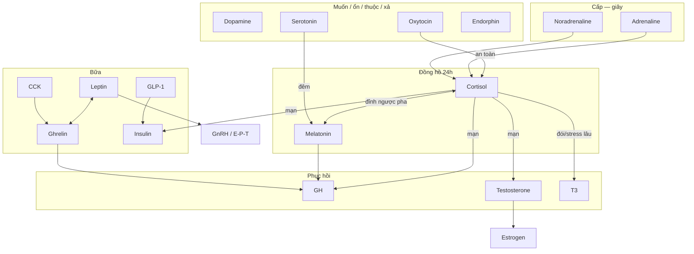

# Quan hệ & tác động lẫn nhau giữa các hormone

> [← Hormone map](./endocrine-hormone-map.md) · [Nhịp 24h](./hormone-rhythm-playbook.md) · [Control playbook](./endocrine-control-playbook.md)

Hormone **không chạy một mình**. Kéo một chất là kéo cụm. Bài này là **bản đồ mũi tên** — ai kích, ai đè, ai đi tuần tự, ai cùng trục. Từng chất: `*-system.md`. Thời gian: [hormone-rhythm-playbook](./hormone-rhythm-playbook.md). Checklist: [endocrine-control-playbook](./endocrine-control-playbook.md).

## Agent SUMMARY

- Đọc mũi tên: **kích / hỗ trợ**, **đè / đối**, **tuần tự** (A thành B), **cùng trục** (đổi tên không đổi việc). Không phải mọi mũi tên là thụ thể trực tiếp — nhiều cái là lối sống / não / ngủ.
- Trục chủ: [cortisol](./cortisol-system.md) ↔ [melatonin](./melatonin-system.md). Hỏng nhịp 24h → serotonin, GH, T, leptin/ghrelin, insulin lệch theo.
- Mood: dopamine = muốn; serotonin = ổn; oxytocin = thuộc về; endorphin = xả. Bốn việc, không thay nhau.
- Ăn: ghrelin (trước) → insulin + GLP-1 + CCK (sau) ↔ leptin (kho). Stress/cortisol đẩy đường lên.
- Phục hồi: cortisol mạn **đè** T và GH. Ngủ + strength kéo cả hai lên cùng chiều.
- Sinh sản: E ↔ P theo pha; T → E (aromatase); leptin thấp **tắt** GnRH.
- Kéo một đòn bẩy nền (ngủ/nắng/ăn/máy) rẻ hơn kéo một hormone. Giáo dục — không chẩn đoán.

---

## 1. Cách đọc mũi tên

| Ký hiệu | Nghĩa | Ví dụ |
| --- | --- | --- |
| **A → B** | A tăng thì B dễ tăng / được phép chạy | Serotonin → melatonin (đêm, tuyến tùng) |
| **A đè B** | A cao (sai lúc / mạn) thì B khó giữ | Cortisol mạn đè testosterone, GH |
| **A ↔ B** | Hai mặt / cân bằng | Cortisol ↔ melatonin (24h); leptin ↔ ghrelin (kho vs đói) |
| **A ≈ B** | Cùng họ / cùng sóng, việc hơi khác | Adrenaline ≈ noradrenaline (SNS) |
| **A ⇒ B** | Cùng gốc hoặc chuyển hóa | Tryptophan ⇒ 5-HT ⇒ melatonin; T ⇒ E2 (aromatase); T4 ⇒ T3 |

Không đọc “A cao = B cao trong máu lúc này”. Nhiều tác động qua **ngủ, viêm, hành vi** (scroll, cô lập), không qua một thụ thể.

---

## 2. Bản đồ tổng



---

## 3. Cụm đồng hồ & stress

| Từ | Đến | Tác động | Đời sống |
| --- | --- | --- | --- |
| Cortisol | Melatonin | Đối pha 24h. Cao đêm đè melatonin | Scroll/deadline tối → mất ngủ |
| Melatonin | Cortisol | Đêm đúng thì sáng dễ có CAR | Dim + giờ ổn |
| Serotonin | Melatonin | Tuần tự (tùng, đêm) | Thiếu nắng → vừa lo vừa mất ngủ |
| Adrenaline / NA | Cortisol | Sóng giây kéo sóng giờ nếu không xuống | Thông báo cả ngày → “điện” tối |
| Oxytocin | Cortisol | Ngữ cảnh an toàn thường hạ HPA xã hội | Ôm/gặp thật ≠ react |
| Cortisol | Insulin | Mạn: đường lên, độ nhạy kém | Thèm stress |
| Cortisol | T / GH / T3 | Mạn đè phục hồi; đói+stress giảm chuyển T3 | Tập mãi không lên |

Deep cặp: [cortisol-melatonin-system](./cortisol-melatonin-system.md). Phanh cấp: [sns-cortisol-brake-playbook](./sns-cortisol-brake-playbook.md).

**Cùng trục SNS:** adrenaline = sóng toàn thân; NA = volume chú ý. Xuống một cái thường cần xuống cả cụm (thở, hết việc, dim).

---

## 4. Cụm mood — bốn việc, không một “hạnh phúc”

| Cặp | Quan hệ | Sai lầm |
| --- | --- | --- |
| Dopamine ↔ Serotonin | Muốn vs ổn. Cần cả hai | Có drive vẫn trống; chỉ cắt feed không nắng |
| Dopamine + Endorphin | Sau tập: wanting lành + relief | Like/scroll = wanting không relief |
| Oxytocin + Serotonin | Có người → dễ giữ nền ổn | Farm online không thay |
| Oxytocin vs cortisol xã hội | An toàn thường hạ cortisol; conflict mãn giữ cao | Ép ôm khi đang sợ |
| Endorphin vs Serotonin | Xả ngắn ≠ nền ngày | Coi runner’s high là trị lo |
| NA + Dopamine | Cùng gốc tyrosine; NA = arousal, DA = muốn | Stimulant tự ý kéo cả hai |

Kéo **nắng + MIT + người + tập** là kéo cả cụm. Kéo một viên “hạnh phúc” là sai tầng.

---

## 5. Cụm ăn — một bữa là một cascade

```text
Trước bữa:  ghrelin ↑
Ăn chậm + đạm + xơ + fat vừa:
    CCK ↑  (mật, no mỡ/đạm)
    secretin ↑  (bicarbonate, pH)
    GLP-1 ↑  (no, chậm dạ dày, insulin khi có đường)
    insulin ↑ rồi phải hạ
    ghrelin ↓
Kho dài hạn: leptin (mỡ + ngủ) ↔ ghrelin
```

| Từ | Đến | Tác động |
| --- | --- | --- |
| GLP-1 | Insulin | Incretin — kích khi *có* glucose |
| CCK / GLP-1 | Ghrelin | No → đói cấp xuống |
| Leptin | Ghrelin | Đối tầng: kho vs đói trước bữa |
| Thiếu ngủ | đè leptin / tăng ghrelin | Đói “thật” dù tủ đầy |
| Insulin crash | Ghrelin / não đói | Ngọt lỏng → đói lại |
| Cortisol / adrenaline | Glucose → insulin | Stress ăn như đường |
| Ghrelin | GH | Có thể kích xung — **không** nhịn để hack GH |

Deep: [glucose-insulin-system](./glucose-insulin-system.md) · [insulin](./insulin-system.md) · [leptin](./leptin-system.md) · [ghrelin](./ghrelin-system.md) · [glp1](./glp1-system.md) · [cck](./cck-system.md) · [secretin](./secretin-system.md).

---

## 6. Cụm phục hồi & sinh sản

| Từ | Đến | Tác động |
| --- | --- | --- |
| Melatonin / ngủ sâu | GH | Cửa xung đêm |
| Strength / HIIT ngắn | GH + T + endorphin + DA | Cùng buổi, khác phân tử |
| Cortisol mạn | đè T và GH | “Tập không lên” |
| T | E2 | Aromatase — nam cần một ít E |
| E ↔ P | Theo pha chu kỳ | Không ép giống nhịp 24h nam |
| Leptin thấp | đè GnRH | Mất kinh / libido — năng lượng, không chỉ ý chí |
| T4 | T3 | Deiodinase; đói/stress giảm chuyển |
| PTH ↔ Calcitonin | Ca máu | PTH giữ Ca (rút xương nếu thiếu D); calcitonin phanh yếu |
| E | Xương | Bảo vệ; thấp + PTH làm nhiều → xương trả |

[ADH](./adh-system.md) ↔ [aldosterone](./aldosterone-system.md): nước tự do vs muối+nước. Rượu đè ADH → tiểu → thức → cortisol đêm → GH/T kém. Không cùng một nút với oxytocin (cùng họ peptide, **khác việc**).

---

## 7. Vòng tốt / vòng xấu (cascade đời sống)

**Vòng tốt**

```text
Nắng + gối đúng
  → cortisol đỉnh sáng, melatonin đêm
  → serotonin ngày, GH/T đêm
  → MIT (DA) + tập (endorphin, insulin nhạy)
  → người thật (oxytocin) hạ cortisol xã hội
  → ngủ dễ hơn
```

**Vòng xấu**

```text
Thiếu ngủ / scroll 1h
  → melatonin kém, CAR lệch
  → leptin ↓ ghrelin ↑ insulin kém
  → thèm + DA rẻ
  → NA/adrenaline nền + cortisol mạn
  → T/GH/T3 xuống
  → cô lập (oxytocin teo) → khó ngủ hơn
```

Sửa từ **đỉnh vòng** (ngủ + nắng), không từ hormone cuối chuỗi. Cùng logic [rhythm playbook](./hormone-rhythm-playbook.md) §8.

---

## 8. Nếu kéo A, bạn cũng kéo B

| Bạn chủ đích | Kéo theo (thường) | Có thể đè |
| --- | --- | --- |
| Nắng sáng | Cortisol đúng pha, serotonin, DA nền | Melatonin ngày (đúng) |
| Dim + ngủ | Melatonin, GH, T, leptin | Cortisol đêm, ghrelin |
| MIT trước feed | DA lành | DA rẻ |
| Protein+xơ+đi bộ | GLP-1, CCK, insulin gọn | Ghrelin sớm, crash |
| Strength | T, GH, endorphin, DA, insulin nhạy | — nếu không overtrain |
| HIIT sát gối | Adrenaline, endorphin | Melatonin / xuống |
| Gặp người | Oxytocin, serotonin | Cortisol xã hội |
| Caffeine muộn | NA, adrenaline | Melatonin |
| Rượu sát gối | — | ADH, GH, melatonin sâu |
| Diet gắt lâu | — | Leptin, T3, GnRH, T/E |

Đây là lý do Daily Stack **bốn đòn bẩy** rẻ hơn 24 protocol.

---

## 9. Cặp đã có file riêng

| Cặp | File | Việc |
| --- | --- | --- |
| Cortisol × melatonin | [cortisol-melatonin-system](./cortisol-melatonin-system.md) | Circadian |
| Glucose × insulin | [glucose-insulin-system](./glucose-insulin-system.md) | Đường–cửa |
| SNS × cortisol cấp | [sns-cortisol-brake-playbook](./sns-cortisol-brake-playbook.md) | Phanh giây |
| T3 × T4 | [t3](./t3-system.md) · [t4](./t4-system.md) | Kho vs hoạt tính |
| E × P | [estrogen](./estrogen-system.md) · [progesterone](./progesterone-system.md) | Pha chu kỳ |
| Leptin × ghrelin | [leptin](./leptin-system.md) · [ghrelin](./ghrelin-system.md) | Kho vs đói |
| PTH × calcitonin | [pth](./pth-system.md) · [calcitonin](./calcitonin-system.md) | Ca máu |
| ADH × aldosterone | [adh](./adh-system.md) · [aldosterone](./aldosterone-system.md) | Nước vs muối |

---

## 10. An toàn

Mũi tên ở đây là **mô hình lối sống**, không phải sơ đồ bệnh hay chỉ định thuốc. Tự kéo một hormone (T, GH, insulin, SSRI, spray oxytocin) kéo cả cụm — việc của bác sĩ. Cụm lâm sàng → khám.

---

## 11. Đọc tiếp

[Map từng chất](./endocrine-hormone-map.md) · [Nhịp 24h](./hormone-rhythm-playbook.md) · [Control cards](./endocrine-control-playbook.md) · [Health README](./README.md)

> **Next:** Chọn *một* vòng bạn đang sống (tốt hay xấu) → sửa đòn bẩy nền 7 ngày → đừng bắn một hormone cuối chuỗi.
