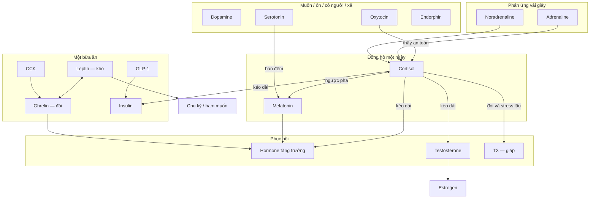

# Hormone tác động lẫn nhau như thế nào

> [← Bản đồ từng hormone](./endocrine-hormone-map.md) · [Nhịp một ngày](./hormone-rhythm-playbook.md) · [Checklist](./endocrine-control-playbook.md)

Hormone **không chạy một mình**. Bạn tác động một chất là kéo theo cả nhóm. Bài này giải thích **chất nào nâng chất nào, chất nào đè chất nào**. Từng hormone một bài: xem [danh sách](./README.md). Về thời điểm trong ngày: [làm chủ nhịp](./hormone-rhythm-playbook.md). Việc cụ thể: [checklist](./endocrine-control-playbook.md).

## Tóm tắt cho agent

- Mũi tên ở đây là mô hình lối sống, không phải đơn thuốc. Nhiều tác động đi qua giấc ngủ và thói quen (lướt điện thoại, cô lập), không phải một thụ thể trong máu.
- Trục gốc: [cortisol](./cortisol-system.md) và [melatonin](./melatonin-system.md) ngược pha trong 24 giờ. Nhịp này hỏng thì serotonin, hormone tăng trưởng, testosterone, leptin, ghrelin, insulin dễ lệch theo.
- Bốn việc mood khác nhau: dopamine = muốn làm; serotonin = thấy ổn; oxytocin = thấy có người; endorphin = dễ chịu sau khi cố. Không thay được nhau.
- Một bữa ăn: ghrelin (đói) trước → insulin, GLP-1, CCK sau khi ăn. Leptin báo “kho năng lượng còn bao nhiêu” theo tuần, không theo từng thìa.
- Cortisol cao kéo dài **làm khó** testosterone và hormone tăng trưởng. Ngủ đủ và tập tạ kéo cả hai theo chiều tốt.
- Kéo bốn việc nền (ngủ, nắng, ăn, vận động) rẻ hơn kéo một hormone ở cuối chuỗi. Giáo dục — không chẩn đoán.

---

## 1. Cách đọc các mối quan hệ

| Cách nói trong bài | Ý nghĩa | Ví dụ |
| --- | --- | --- |
| A **kéo theo** B | A tăng thì B dễ tăng, hoặc B được phép chạy | Ban đêm serotonin được dùng để tạo melatonin |
| A **đè** B | A cao sai lúc, hoặc cao dai dẳng, thì B khó giữ | Cortisol căng thẳng kéo dài đè testosterone và hormone tăng trưởng |
| A và B **ngược pha / cân bằng** | Một bên lên thì bên kia thường xuống, hoặc hai tầng khác nhau | Cortisol cao sáng, melatonin cao đêm; leptin (kho) và ghrelin (đói trước bữa) |
| A và B **cùng họ** | Cùng một sóng, việc hơi khác | Adrenaline (cả người) và noradrenaline (tỉnh, tập trung) |
| A **chuyển thành** B | Cùng chuỗi hóa học | Tryptophan → serotonin → melatonin; testosterone → estrogen; T4 → T3 |

Đừng đọc thành: “A cao trong máu lúc này thì B cũng cao”. Nhiều khi A chỉ làm bạn ngủ kém, rồi B mới lệch.

---

## 2. Nhìn cả hệ một lần

---

## 3. Nhóm đồng hồ và căng thẳng

| Từ | Đến | Chuyện gì xảy ra | Trong đời thường |
| --- | --- | --- | --- |
| Cortisol | Melatonin | Ban ngày–ban đêm ngược nhau. Cortisol cao ban đêm làm melatonin khó lên | Lướt điện thoại, deadline tối → khó ngủ |
| Melatonin | Cortisol | Đêm đúng nhịp thì sáng hôm sau cortisol dễ lên đúng lúc | Đèn dịu, giờ ngủ ổn |
| Serotonin | Melatonin | Ban đêm, tuyến tùng dùng serotonin để tạo melatonin | Thiếu nắng → vừa lo vừa mất ngủ |
| Adrenaline / noradrenaline | Cortisol | Sóng vài giây, nếu không hạ, kéo theo sóng vài giờ | Thông báo cả ngày → tối vẫn căng |
| Oxytocin | Cortisol | Gặp người an toàn thường làm dịu căng thẳng vì chuyện người | Ôm hoặc gặp mặt khác thả cảm xúc trên mạng |
| Cortisol | Insulin | Căng thẳng kéo dài: đường trong máu dễ lên, cơ thể kém nhạy insulin | Ăn vì stress |
| Cortisol | Testosterone, hormone tăng trưởng, T3 | Kéo dài thì phục hồi kém; đói lâu + stress làm T3 (bản hoạt của hormone giáp) giảm | Tập mãi không lên |

Đọc sâu cặp ngày–đêm: [cortisol và melatonin](./cortisol-melatonin-system.md). Đang tim đập, hoảng: [cách hạ hệ giao cảm](./sns-cortisol-brake-playbook.md).

Adrenaline và noradrenaline cùng một họ. Adrenaline làm cả người “chiến hoặc chạy” (tim, mồ hôi). Noradrenaline nghiêng về tỉnh táo và tập trung. Hạ một cái thường cần hạ cả nhóm: thở chậm, xong việc, giảm đèn.

---

## 4. Nhóm tâm trạng — bốn việc, không một thứ gọi là “hạnh phúc”

| Hai chất | Quan hệ | Hay nhầm |
| --- | --- | --- |
| Dopamine và serotonin | Dopamine = muốn làm. Serotonin = thấy ổn, ít sóng. Cần cả hai | Có mục tiêu vẫn trống rỗng; chỉ cắt mạng mà không ra nắng |
| Dopamine và endorphin | Sau tập: vừa thấy “tôi đã làm được”, vừa dễ chịu | Lướt mạng chỉ cho “muốn thêm”, không cho dễ chịu sau nỗ lực |
| Oxytocin và serotonin | Có người tử tế thì nền tâm trạng dễ giữ | Tương tác trên mạng không thay gặp mặt |
| Oxytocin và cortisol vì chuyện người | An toàn thường hạ cortisol; cãi nhau kéo dài thì cortisol giữ cao | Ép ôm khi đang sợ |
| Endorphin và serotonin | Dễ chịu sau tập là ngắn. Ổn cả ngày là việc khác | Coi “phê sau chạy bộ” là chữa lo âu |
| Noradrenaline và dopamine | Cùng gốc từ một amino acid. Một cái là độ tỉnh, một cái là muốn | Tự uống chất kích thích kéo cả hai |

Ra nắng, làm xong một việc khó, gặp người, tập đủ sức — đó là kéo cả nhóm. Một viên “tăng hạnh phúc” là sai tầng.

---

## 5. Một bữa ăn là một chuỗi

Trước bữa, **ghrelin** (hormone đói) tăng.

Bạn ăn chậm, có đạm, có xơ, có một ít chất béo tốt thì:

- **CCK** tăng — túi mật và tụy làm việc, bạn no vì mỡ và đạm.
- **Secretin** tăng — tụy tiết dịch kiềm, ruột không bị acid “đốt”.
- **GLP-1** tăng — no lâu hơn, dạ dày chậm lại, insulin lên khi **có đường** trong máu.
- **Insulin** tăng rồi phải hạ lại.
- **Ghrelin** giảm — hết đói cấp.

Lâu hơn một bữa: **leptin** báo não “kho năng lượng (mỡ) còn bao nhiêu”. Nó cân với ghrelin, không thay ghrelin.

| Từ | Đến | Chuyện gì xảy ra |
| --- | --- | --- |
| GLP-1 | Insulin | Giúp tụy tiết insulin khi máu đang có đường |
| CCK và GLP-1 | Ghrelin | No thì đói cấp xuống |
| Leptin | Ghrelin | Một cái là kho dài hạn, một cái là đói trước bữa |
| Thiếu ngủ | Leptin giảm, ghrelin tăng | Đói “thật” dù tủ lạnh đầy |
| Insulin tăng rồi tụt mạnh | Não báo đói, ghrelin dễ về | Uống nước ngọt → đói lại |
| Cortisol / adrenaline | Đường trong máu lên, rồi insulin | Ăn vì stress giống ăn đường |
| Ghrelin | Hormone tăng trưởng | Có thể kích một đợt tiết — **đừng** nhịn ăn để “hack” hormone tăng trưởng |

Đọc sâu: [đường và insulin](./glucose-insulin-system.md) · [insulin](./insulin-system.md) · [leptin](./leptin-system.md) · [ghrelin](./ghrelin-system.md) · [GLP-1](./glp1-system.md) · [CCK](./cck-system.md) · [secretin](./secretin-system.md).

---

## 6. Phục hồi, sinh sản, nước, xương

| Từ | Đến | Chuyện gì xảy ra |
| --- | --- | --- |
| Melatonin / ngủ sâu | Hormone tăng trưởng | Ban đêm mới có cửa tiết theo đợt |
| Tập tạ hoặc tập nặng ngắn | Hormone tăng trưởng, testosterone, endorphin, dopamine | Cùng một buổi, khác phân tử |
| Cortisol kéo dài | Đè testosterone và hormone tăng trưởng | “Tập mãi không lên” |
| Testosterone | Estrogen | Cơ thể chuyển một phần (nam cũng cần một ít estrogen) |
| Estrogen và progesterone | Theo pha chu kỳ tháng | Đừng ép giống nhịp 24 giờ của nam |
| Leptin thấp | Não giảm tín hiệu sinh sản | Mất kinh hoặc mất ham muốn — thiếu năng lượng, không chỉ thiếu ý chí |
| T4 | T3 | T4 là kho; T3 là bản đang chạy. Đói lâu và stress làm chuyển kém |
| PTH và calcitonin | Canxi trong máu | PTH giữ canxi (thiếu vitamin D thì dễ rút từ xương); calcitonin là phanh yếu hơn ở người lớn |
| Estrogen | Xương | Bảo vệ xương; estrogen thấp mà PTH phải làm nhiều thì xương chịu |

[ADH](./adh-system.md) giữ **nước**. [Aldosterone](./aldosterone-system.md) giữ **muối** (nước đi theo muối). Rượu ức chế ADH → tiểu nhiều → thức đêm → cortisol ban đêm → hormone tăng trưởng và testosterone kém. ADH và oxytocin cùng một họ peptide nhưng **không cùng một việc** (một cái giữ nước, một cái gắn kết).

---

## 7. Vòng tốt và vòng xấu

**Vòng tốt**

Ra nắng và ngủ đúng giờ → cortisol cao sáng, melatonin cao đêm → serotonin ban ngày, hormone tăng trưởng và testosterone ban đêm → làm được việc khó (dopamine) và tập (endorphin, insulin nhạy hơn) → gặp người thật (oxytocin) làm dịu cortisol vì chuyện người → ngủ dễ hơn.

**Vòng xấu**

Thiếu ngủ hoặc lướt điện thoại đến khuya → melatonin kém, đỉnh cortisol sáng lệch → leptin giảm, ghrelin tăng, insulin kém nhạy → thèm và tìm kích thích rẻ trên mạng → adrenaline không tắt, cortisol kéo dài → testosterone, hormone tăng trưởng, T3 xuống → ít gặp người (oxytocin yếu) → càng khó ngủ.

Sửa từ **đầu vòng** (ngủ và nắng), đừng sửa từ hormone cuối chuỗi. Cùng cách trong [bài nhịp](./hormone-rhythm-playbook.md) phần “khi lệch”.

---

## 8. Bạn chủ đích một việc — thường kéo theo việc khác

| Bạn cố làm | Thường kéo theo (tốt) | Có thể làm khó |
| --- | --- | --- |
| Ra nắng buổi sáng | Cortisol đúng giờ, serotonin, nền dopamine | Melatonin ban ngày — đây là đúng |
| Đèn dịu và ngủ đủ | Melatonin, hormone tăng trưởng, testosterone, leptin | Cortisol đêm, ghrelin |
| Việc khó xong rồi mới mở mạng | Dopamine “kiếm được” | Dopamine rẻ từ lướt mạng |
| Đạm, xơ, đi bộ sau ăn | GLP-1, CCK, insulin tăng rồi hạ gọn | Đói sớm, mệt sau ăn |
| Tập tạ | Testosterone, hormone tăng trưởng, endorphin, dopamine, insulin nhạy hơn | Không được nếu tập quá, không nghỉ |
| Tập rất nặng sát giờ ngủ | Adrenaline, endorphin | Melatonin, khó hạ |
| Gặp người | Oxytocin, serotonin | Cortisol vì chuyện người (nếu cuộc gặp an toàn) |
| Cà phê muộn | Noradrenaline, adrenaline | Melatonin |
| Rượu gần giờ ngủ | — | ADH, hormone tăng trưởng, ngủ sâu |
| Ăn kiêng cắt gắt nhiều tuần | — | Leptin, T3, chu kỳ / ham muốn, testosterone và estrogen |

Vì vậy bộ việc nền mỗi ngày (ngủ, nắng, ăn, vận động) rẻ hơn hai mươi phác đồ riêng.

---

## 9. Cặp đã có bài riêng

| Cặp | Bài | Việc của cặp |
| --- | --- | --- |
| Cortisol và melatonin | [cortisol-melatonin-system](./cortisol-melatonin-system.md) | Ngày và đêm |
| Đường và insulin | [glucose-insulin-system](./glucose-insulin-system.md) | Ăn và năng lượng |
| Hệ giao cảm và cortisol cấp | [cách phanh](./sns-cortisol-brake-playbook.md) | Tim đập, hoảng trong vài phút |
| T3 và T4 | [T3](./t3-system.md) · [T4](./t4-system.md) | Kho và bản đang chạy của giáp |
| Estrogen và progesterone | [estrogen](./estrogen-system.md) · [progesterone](./progesterone-system.md) | Hai pha chu kỳ |
| Leptin và ghrelin | [leptin](./leptin-system.md) · [ghrelin](./ghrelin-system.md) | Kho và đói trước bữa |
| PTH và calcitonin | [PTH](./pth-system.md) · [calcitonin](./calcitonin-system.md) | Canxi máu |
| ADH và aldosterone | [ADH](./adh-system.md) · [aldosterone](./aldosterone-system.md) | Nước và muối |

---

## 10. An toàn

Các mũi tên ở đây giúp hiểu lối sống, không phải sơ đồ bệnh, không phải chỉ định thuốc. Tự dùng testosterone, hormone tăng trưởng, insulin, thuốc chống trầm cảm hay xịt oxytocin là kéo cả nhóm — việc của bác sĩ. Có cụm triệu chứng bệnh thì đi khám.

---

## 11. Đọc tiếp

[Bản đồ từng hormone](./endocrine-hormone-map.md) · [Nhịp một ngày](./hormone-rhythm-playbook.md) · [Checklist](./endocrine-control-playbook.md) · [Danh sách bài](./README.md)

> Chọn một vòng bạn đang sống — tốt hay xấu — rồi sửa ngủ và nắng trong bảy ngày. Đừng “bắn” một hormone ở cuối chuỗi.
