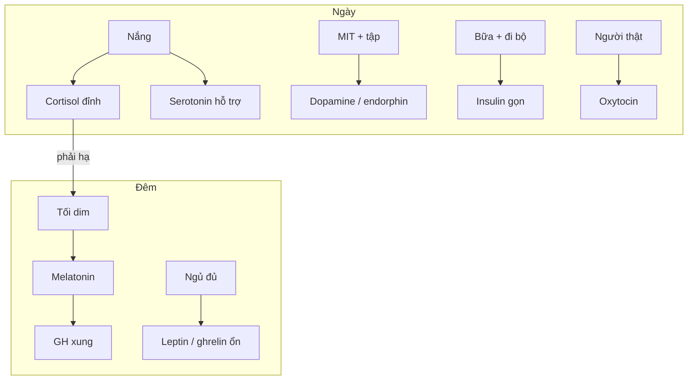

# Làm chủ nhịp điệu hormone

> [← Hormone map](./endocrine-hormone-map.md) · [Tương tác](./hormone-interaction-map.md) · [Control cards](./endocrine-control-playbook.md) · [Cặp circadian](./cortisol-melatonin-system.md) · [Sleep](./sleep-optimization.md)

Bạn **không** làm chủ hormone bằng cách kéo 24 slider. Bạn làm chủ **nhịp**: đúng chất, đúng cửa sổ, rồi để hệ tự chạy. Checklist đòn bẩy nằm ở [endocrine-control-playbook](./endocrine-control-playbook.md). Bài này là **nhạc trưởng thời gian**.

## Agent SUMMARY

- Làm chủ = **canh nhịp**, không max mọi hormone cùng lúc. Đồng hồ chủ: **ánh sáng + giờ ngủ**.
- Trục ngày: [cortisol](./cortisol-system.md) đỉnh sáng → hạ tối. Trục đêm: [melatonin](./melatonin-system.md) lên khi tối. Hỏng hai trục này thì serotonin, GH, T, leptin/ghrelin, insulin đều lệch theo.
- Bốn đòn bẩy nền (ngủ, sáng, ăn, máy) kéo ~70% bản nhạc. Chỉ chọn **1–2 hormone focus / tuần**.
- Ngày mẫu: nắng + MIT + protein → đi bộ sau ăn → tập đủ ngưỡng → người thật → dim + cutoff → ngủ cửa sổ.
- Phá nhịp cổ điển: scroll lúc thức, caffeine muộn, rượu sát gối, ngọt lỏng, deadline không cửa xuống, cuối tuần lệch 3–4h.
- Giáo dục lối sống. Không tự kê hormone. Cấp (tim, tự hại, ĐTĐ) → chuyên khoa / cấp cứu.

---

## 1. Làm chủ = canh nhịp, không max slider

Hormone khỏe là hormone **đúng lúc**, không phải “càng cao càng tốt”.

| Sai mục tiêu | Đúng mục tiêu |
| --- | --- |
| Cortisol luôn thấp | Cao sáng, thấp tối |
| Melatonin luôn cao | Thấp ngày, cao đêm |
| Dopamine luôn spike | Nền ổn + spike từ việc khó |
| Insulin luôn thấp | Sóng sau ăn rồi về, độ nhạy tốt |
| Adrenaline luôn sẵn | Có khi cần, tắt được |
| GH / T “tăng mãi” | Xung đêm + tín hiệu tập — không lọ |

```text
Đồng hồ chủ (ánh sáng + ngủ)
        ↓
Cortisol ↔ Melatonin (24h)
        ↓
Serotonin ngày → melatonin đêm
Dopamine / NA: tỉnh và muốn đúng cửa
Insulin / GLP-1 / CCK / ghrelin: theo bữa
GH / T: đêm + tập
Oxytocin / endorphin: người + nỗ lực (không buộc theo giờ cố)
```

Quy tắc vận hành giống playbook §0: Daily Stack mỗi ngày → tối đa 1–2 card/tuần → review. Không tối ưu 24 chất một lúc.

---

## 2. Đồng hồ chủ — hai tín hiệu không thương lượng

Não (SCN) đọc **ánh sáng võng mạc** rồi chỉnh cả dàn.

| Tín hiệu | Việc | Kéo mạnh |
| --- | --- | --- |
| Nắng ngoài trời 10–30′ sau thức | “Trời sáng” | [Cortisol](./cortisol-system.md) đỉnh đúng, [melatonin](./melatonin-system.md) ngày thấp, [serotonin](./serotonin-system.md) hỗ trợ |
| Tối dim T−60′ + phòng tối mát | “Trời tối” | Melatonin lên, cortisol xuống, cửa [GH](./growth-hormone-system.md) |
| Giờ ngủ/thức ổn (±1h) | Khóa pha | Cả dàn; lệch cuối tuần = jet-lag xã hội |

Không có supplement nào thay hai tín hiệu này. Chi tiết cặp: [cortisol-melatonin-system](./cortisol-melatonin-system.md). Giường: [sleep-optimization](./sleep-optimization.md).

---

## 3. Timeline 24h (gần đúng — chỉnh theo giờ thức của bạn)

Giả sử thức ~06:30–07:30. Owl/ca đêm: **dịch cả hàng**, đừng copy 23:00 nếu bạn thức 10:00.

| Cửa sổ | Nhịp đang “hát” | Bạn làm | Không làm |
| --- | --- | --- | --- |
| 0–90′ sau thức | Cortisol ↑ (CAR), melatonin ↓, NA/tỉnh | Ra ngoài trời; nước; protein; **chưa** scroll | Doomscroll, kính râm cả buổi, caffeine *ngay* lúc thức (nếu muốn giữ CAR) |
| Sáng–trưa | Dopamine/NA hữu ích, serotonin ngày, ghrelin theo bữa | MIT / deep work; caffeine sau ~90′; bữa có đạm+xơ | Tab + ping cả buổi (NA rẻ) |
| Sau bữa chính | Insulin ↑ rồi phải hạ; GLP-1 / CCK no | Đi bộ 10–20′ | Nằm + ngọt lỏng |
| Chiều | Còn cửa tập; cortisol đang xuống dần | Strength / Zone-2 / interval (không đau) | HIIT sát gối nếu mất ngủ |
| T−3h | Adrenaline/NA cần xuống | Cutoff caffeine (thường ≤14–16h) | Deadline giả + tin nóng |
| T−2h → gối | Melatonin ↑, cortisol thấp, ADH giữ nước | Dim; bữa không nhồi đường; rượu thấp | Rượu “cho ngủ”, horror-scroll |
| Đêm ngủ sâu | GH xung, T hỗ trợ, leptin/ghrelin reset | Phòng mát tối; giờ ổn | Thức 1–3h đèn + điện thoại |



Hormone **không buộc theo đồng hồ cố** nhưng vẫn có nhịp *dịp*:

- [Oxytocin](./oxytocin-system.md): khi có người an toàn — calendar 1–3 cuộc, không “để xảy ra”.
- [Endorphin](./endorphin-system.md): khi đủ ngưỡng tập / cười — 2–4 buổi/tuần.
- [Estrogen](./estrogen-system.md) / [progesterone](./progesterone-system.md): nhịp **chu kỳ**, không phải 24h — track tháng, đừng ép giống nam T.
- [PTH](./pth-system.md) / [aldosterone](./aldosterone-system.md) / [ADH](./adh-system.md): theo Ca, muối, nước, rượu — không “tối ưu sáng”.

---

## 4. Làm chủ từng cụm (một việc canh cả cụm)

### 4.1 Tỉnh–ngủ (nền của mọi thứ)

**Canh:** nắng sáng + tối tối + giờ cố.

**Thắng:** cortisol đúng pha, melatonin đêm, serotonin → melatonin, GH/T dễ hơn.

**Thua:** thiếu ngủ một đêm → leptin ↓ ghrelin ↑ insulin kém + dopamine rẻ ngày hôm sau.

Bài: [cortisol](./cortisol-system.md) · [melatonin](./melatonin-system.md) · [serotonin](./serotonin-system.md) · [GH](./growth-hormone-system.md).

### 4.2 Muốn–ổn–thuộc về

| Chất | Nhịp bạn tạo | Canh |
| --- | --- | --- |
| [Dopamine](./dopamine-system.md) | Spike sau MIT / tập, không lúc thức | Phone sau việc khó |
| [Serotonin](./serotonin-system.md) | Nền ngày bằng nắng + đi bộ | Không 5-HTP |
| [Oxytocin](./oxytocin-system.md) | Lặp người thật | Phone úp khi gặp |
| [Endorphin](./endorphin-system.md) | Sau nỗ lực đủ ngưỡng | Không chase đau |

### 4.3 Cấp (giây) vs chậm (giờ)

[Adrenaline](./adrenaline-system.md) / [noradrenaline](./noradrenaline-system.md) = cửa **bật–tắt**. Có MIT hoặc HIIT rồi **xuống** (thở, nhìn rộng): [sns-cortisol-brake-playbook](./sns-cortisol-brake-playbook.md). Cortisol = sóng chậm — đừng để tối vẫn on.

### 4.4 Ăn (nhịp bữa, không nhịp 24h giả)

Mỗi bữa là một chu kỳ: [ghrelin](./ghrelin-system.md) trước → [insulin](./insulin-system.md) + [GLP-1](./glp1-system.md) + [CCK](./cck-system.md) sau → no. Canh: protein+xơ, chậm, đi bộ. Phá: sipping ngọt. Deep: [glucose-insulin-system](./glucose-insulin-system.md).

### 4.5 Phục hồi & sinh sản

[T](./testosterone-system.md) / GH: ngủ + strength, không rượu sát gối. E/P: năng lượng đủ, đừng thâm hụt cực. Giáp T3/T4: **không** canh giờ — canh đừng đói lâu + ngủ; triệu chứng → BS.

---

## 5. Ngày mẫu — nhạc trưởng (30–50′ cộng dồn, không thêm 12 habit)

Chạy đúng [Master Daily Stack](./endocrine-control-playbook.md) §1. Rút thành nhịp:

1. **Khóa sáng** — ra ngoài trước feed.  
2. **Một thắng** — MIT xong mới caffeine/mạng (nếu được).  
3. **Mỗi bữa chính** — đạm+xơ, đi bộ ngắn.  
4. **Một cửa người** — gặp/gọi, không react.  
5. **Một cửa xả** — tập đủ ngưỡng *hoặc* đi bộ dài (ngày nghỉ).  
6. **Một cửa xuống** — 5′ không tin nóng nếu ngày “điện”.  
7. **Khóa tối** — cutoff caffeine, dim, gối đúng cửa sổ.

Đó là làm chủ nhịp. Không cần nhớ 24 tên hormone lúc đánh răng.

---

## 6. Tuần mẫu

| Nhịp tuần | Việc | Hormone |
| --- | --- | --- |
| 2–4 buổi nặng hoặc interval | Thở mệt vừa, không đau | Endorphin, T, GH, insulin nhạy |
| ≥1 cuộc gặp/bữa đã ghi lịch | Người thật | Oxytocin |
| Giờ ngủ lệch cuối tuần ≤1h | Khóa SCN | Melatonin, cortisol |
| 1 focus card (playbook §2) | Chỉ khi Daily Stack đã chạy | Hormone bạn chọn |
| Chủ nhật 15′ review | Sleep, crash, stress, tập | Playbook §3 |

Không 7 ngày HIIT (NA/cortisol stuck). Không “detox hormone” cuối tuần bằng thức 3h.

---

## 7. Phá nhịp — danh sách ngắn

| Phá | Nhịp vỡ |
| --- | --- |
| Scroll lúc thức | Dopamine rẻ; CAR/cortisol lệch cảm giác |
| Caffeine muộn | Melatonin, ngủ |
| Rượu sát gối | [ADH](./adh-system.md) ↓, thức tiểu, GH kém |
| Ngọt lỏng / nhồi | Insulin–crash, ghrelin về sớm |
| Thông báo cả ngày | NA/adrenaline nền |
| Conflict + cô lập | Oxytocin teo, cortisol xã hội |
| Thức đêm đèn | Melatonin, GH, T, leptin |
| Crash diet nhiều tuần | T3 chuyển giảm, leptin thấp — “máy chậm” |

Cấp đang panic: **không** ép vui / ép biết ơn. Phanh SNS trước.

---

## 8. Khi lệch — sửa theo tầng, không theo tên hormone

1. **Ngủ + nắng 7 ngày** — hầu hết “hỏng serotonin/T/GH” bắt đầu đây.  
2. **Ăn + đi bộ sau bữa** — crash, thèm.  
3. **Cửa xuống tối + cutoff** — “điện”, khó vào giấc.  
4. **Một MIT trước feed** — trống động lực.  
5. **Người / tập** — cô độc hoặc tê.  
6. Vẫn cụm lâm sàng → **bác sĩ** (giáp, ĐTĐ, trầm, HA, chu kỳ). Không thêm supplement lớp 6.

---

## 9. Proxy — không xét nghiệm 24 hormone

| Nhịp | Hỏi mỗi ngày | Chỗ ghi |
| --- | --- | --- |
| Sáng tỉnh | Ra ngoài chưa? Scroll trước MIT? | `personal/daily/` |
| Ăn | Crash 1–3h? | `personal/nutrition/` |
| Xã hội | Tiếp xúc chất lượng? □ | daily / habits |
| Tập | Đủ ngưỡng, không đau? | habits |
| Đêm | Phút vào giấc, quality | `body/metrics.csv` |
| Stress | 1–10; khó xuống tối? | daily |

Theory ở guides; số của bạn ở [`personal/`](../../../personal/README.md) — chỉ khi bạn tự track.

---

## 10. An toàn

Giáo dục — không chẩn đoán, không tự GH/T/insulin/SSRI/oxytocin spray. Ý nghĩ tự hại, đau ngực, khát–tiểu–sụt cân lạ → cấp cứu / BS.

---

## 11. Đọc tiếp

| Nhu cầu | Doc |
| --- | --- |
| Checklist ngày + card từng chất | [endocrine-control-playbook.md](./endocrine-control-playbook.md) |
| Bản đồ hormone | [endocrine-hormone-map.md](./endocrine-hormone-map.md) |
| Deep circadian | [cortisol-melatonin-system.md](./cortisol-melatonin-system.md) |
| Phanh cấp | [sns-cortisol-brake-playbook.md](./sns-cortisol-brake-playbook.md) |
| Routine tổng | [health-optimization-protocols.md](./health-optimization-protocols.md) |
| Từng chất | `*-system.md` trong [health README](./README.md) |

> **Next:** 7 ngày chỉ khóa sáng + khóa tối. Rồi mới mở card hormone thứ hai.
