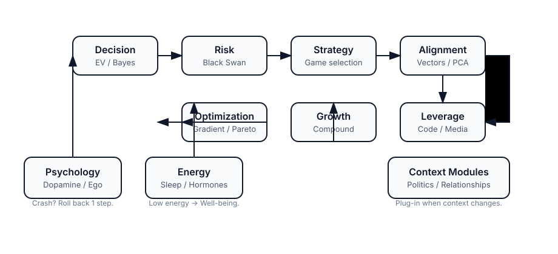

# 🧬 Life Operating System (Hệ điều hành Cuộc đời)

> **"We do not rise to the level of our goals. We fall to the level of our systems."** - *James Clear*

Life OS là tập hợp các mô hình tư duy (Mental Models) được cấu trúc hóa để giúp bạn vận hành cuộc đời như một cỗ máy hiệu suất cao, tối ưu hóa từ năng lượng sinh học đến chiến lược đòn bẩy.

---

## 🏗️ The 6 Core Engines (6 Động cơ Cốt lõi)
*Bộ vi xử lý trung tâm (CPU) của hệ thống. Trước khi triển khai các module Well-being hay Politics, hãy đảm bảo bạn đã “cài” ít nhất Decision/Risk Engine để biết cách chọn lựa và phòng thủ.*

1.  **[Decision Engine (Ra quyết định)](./decision-engine.md):** Expected Value, Bayes, Kelly. *Chọn đúng việc.*
2.  **[Growth Engine (Tăng trưởng)](./growth-engine.md):** Compound Interest, Network Effects. *Đi nhanh hơn.*
3.  **[Risk Engine (Phòng thủ)](./risk-engine.md):** Black Swan, Antifragile, Redundancy. *Không chết.*
4.  **[Strategy Engine (Chiến lược)](./strategy-engine.md):** Game Theory, Nash Equilibrium. *Thắng cuộc chơi.*
5.  **[Optimization Engine (Tối ưu)](./optimization-engine.md):** Gradient Descent, Pareto, Marginal Utility. *Hiệu quả nhất.*
6.  **[Alignment Engine (Định hướng)](./alignment-engine.md):** Vectors, PCA, Regret Minimization. *Đi đúng hướng.*

### ⚙️ Sub-Engines (Động cơ Phụ trợ)
*Các module chuyên biệt giúp tinh chỉnh lớp vận hành hàng ngày sau khi đã cài đặt xong CPU.*
1. **[Focus Engine (Sự chú ý)](./focus-engine.md):** Deep Work, Second Brain. *Bảo vệ tài nguyên não.*
2. **[Network & Politics Engine (Mạng lưới & Quyền lực)](./network-politics-engine.md):** Hubs, Social Moat. *Tồn tại trong tập thể.*
3. **[Resource Allocation Engine (Phân bổ Nguồn lực)](./resource-allocation-engine.md):** Explore/Exploit, ROI of Time. *Tiêu chuẩn hóa quyết định chi tiêu năng lượng.*

> **Quick anchors:** [Decision](./decision-engine.md) · [Risk](./risk-engine.md) · [Strategy](./strategy-engine.md) · [Alignment](./alignment-engine.md) · [Growth](./growth-engine.md) · [Optimization](./optimization-engine.md) · [Focus](./focus-engine.md) · [Network](./network-politics-engine.md) · [Allocation](./resource-allocation-engine.md) · [Leverage](./leverage-theory.md) · [Psychology](./psychology-of-self.md) · [Energy](./energy-management.md)

> **Ôn nhanh:** Cần nhớ thứ tự cài đặt và template chính? Mở [Life OS One-Pager](./one-pager.md).

### 🧭 Khi nào dùng engine nào?
| Tình huống | Engine cần mở | Kết quả mong đợi |
| --- | --- | --- |
| Quyết định lớn (đổi việc, đầu tư, chọn đối tác) | [Decision](./decision-engine.md) + [Risk](./risk-engine.md) | Tính EV, check ruin, thiết kế Plan B trước khi commit. |
| Mất phương hướng, thấy nỗ lực triệt tiêu nhau | [Alignment](./alignment-engine.md) + [Strategy](./strategy-engine.md) | Chuẩn hóa vector sống, chọn đúng game/ngách để tập trung. |
| Muốn tăng thu nhập bền vững / scale business | [Growth](./growth-engine.md) + [Leverage](./leverage-theory.md) | Thiết kế flywheel, bật đòn bẩy Code/Media/Capital để compound. |
| Hệ thống bắt đầu vỡ vì quá tải (ops, daily work) | [Optimization](./optimization-engine.md) + [Resource Allocation](./resource-allocation-engine.md) | Phân bổ lại tài nguyên, dừng local maxima. |
| Burnout, mất động lực/attention | [Focus](./focus-engine.md) + [Energy Management](./energy-management.md) | Reset bộ lọc nhiễu, đẩy não vào trạng thái Deep Work. |
| Mâu thuẫn công sở, cần lobby/kết nối sinh lợi | [Network & Politics](./network-politics-engine.md) + [Strategy](./strategy-engine.md) | Tránh zero-sum game, trở thành Hub của hệ thống. |

### 🔭 Visual Map: Life OS Flow

> **Cách đọc bản đồ:** Bất cứ khi nào hệ thống crash (thiếu năng lượng, lệch vector), quay lại nhánh Psychology/Energy. Khi đã ổn định foundation (Decision + Risk), chuyển sang Strategy/Alignment để chọn game phù hợp rồi bật Growth → Optimization → Leverage. Các module Relationships, Politics, Well-being được cắm vào các nút tương ứng khi cần.

### 📚 Đào sâu / Nền tảng
- **Toán & Xác suất:** Học gốc cho EV, Bayes tại [01-Mental Models / Mathematics](../01-mental-models/probability-calculus.md) *(nếu cần file cụ thể, link placeholder)*
- **Psychology & Biases:** Debug thói quen và nhận bias tại [01-Mental Models / Psychology](../01-mental-models/influence-negotiation.md)
- **Philosophy & Meaning:** Khung ethics, meaning, antifragile tại [01-Mental Models / Philosophy](../01-mental-models/README.md)
- **Template Library:** Ghi log/decision/risk radar tại [Templates](../../templates/README.md)

---

## 🧩 Thứ tự Cài đặt / Learning Path
*Học Life OS như cài phần mềm: mỗi engine phụ thuộc engine trước. Đi theo thứ tự này để tránh overload và biết lúc nào kích hoạt module khác.*

1.  **Decision + Risk (Foundation):** Học cách chọn việc và không chết trước – xem [Decision Engine](./decision-engine.md) rồi khóa bảo hiểm ở [Risk Engine](./risk-engine.md).
2.  **Strategy + Alignment (Direction):** Khi đã phòng thủ ổn, chuyển sang thiết kế vector sống và chiến lược bằng [Strategy Engine](./strategy-engine.md) + [Alignment Engine](./alignment-engine.md).
3.  **Energy + Psychology of Self (Hardware & Firmware):** Dùng [Energy Management](./energy-management.md) để kiểm soát năng lượng, kết hợp [Psychology of Self](./psychology-of-self.md) để debug thói quen & ego.
4.  **Relationships & Contexts:** Khi tương tác xã hội bắt đầu ảnh hưởng mạnh đến quyết định, đọc [Psychology Reading Women](../psychology-reading-women.md) + [Psychology Women Contexts](../psychology-women-contexts.md) để hiểu các tình huống giao tiếp (thuộc Life OS – mục Quan hệ & Giao tiếp).
5.  **Optimization + Growth (Performance Upgrade):** Tối ưu hệ thống hiện tại với [Optimization Engine](./optimization-engine.md) trước khi tăng tốc cùng [Growth Engine](./growth-engine.md).
6.  **Leverage (Multiplier Mode):** Khi nền tảng vững, mở rộng bằng [Leverage Theory](./leverage-theory.md) để nhân hệ số (Code, Media, Capital, People).

> **Tip:** Mỗi lần cài xong 1 bước, viết lại checklist ứng dụng và chạy thử trong 2-4 tuần. Nếu thấy hệ thống crash (mất năng lượng, mất vector), quay lại bước trước để patch.

---

## 🔋 The Hardware (Phần cứng & Năng lượng)
*Hệ thống hỗ trợ để CPU hoạt động không bị nóng/treo. Chi tiết giao thức ở module [Well-being](../well-being/README.md), nhưng đây là bản tóm tắt.*

1.  **[Psychology of Self (Tâm lý Bản thân)](./psychology-of-self.md):** Debug cái Tôi (Ego), quản lý Dopamine và thói quen.
2.  **[Energy Management (Quản trị Năng lượng)](./energy-management.md):** Giấc ngủ, Hormones, Burnout. Bảo trì cỗ máy sinh học.

---

## 🚀 The Multiplier (Hệ số nhân)
*Biến nỗ lực tuyến tính thành kết quả mũ. Khi đã hiểu Politics/Quyền lực, bạn sẽ thấy Leverage Theory áp dụng vào cả quy mô quốc gia.*

1.  **[Leverage Theory (Lý thuyết Đòn bẩy)](./leverage-theory.md):** Code, Media, Capital, Labor. Tách rời thời gian khỏi thu nhập.

---

## 🗺️ Cách sử dụng Life OS
1.  **Audit:** Dùng các câu hỏi Check-in cuối mỗi module để đánh giá tình trạng hiện tại (hoặc dùng [Lifestyle Audit](../README.md)).
2.  **Install:** Chọn 1 Engine đang yếu nhất để "cài đặt" (thực hành) vào tuần này.
3.  **Update:** Hệ thống cần được cập nhật liên tục thông qua trải nghiệm thực tế (Feedback Loop). Khi gặp vấn đề về năng lượng, quay về module Well-being; khi gặp biến động môi trường, kích hoạt Politics.
