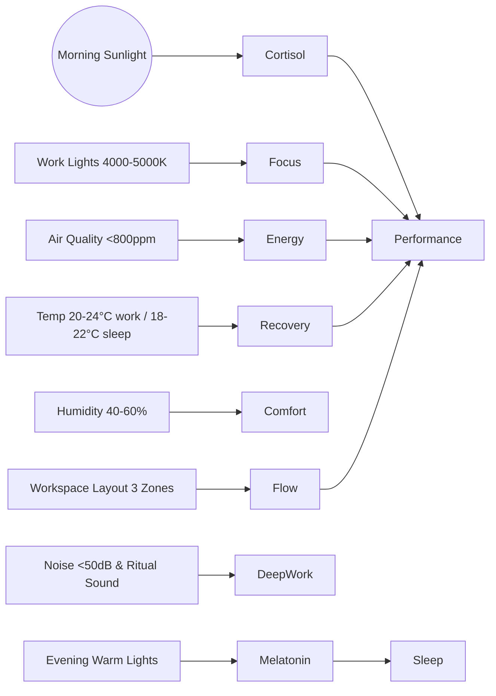

# 🛠️ Environment & Workspace Setup

> Hệ thần kinh chỉ làm việc tốt nếu “hardware” (ánh sáng, không khí, nhiệt độ, âm thanh) hỗ trợ. File này tóm tắt các nguyên tắc chính, còn checklist chi tiết xem ở [Environment Checklist](./environment-checklist.md).

---

## 1. Ánh sáng & Blue Light Hygiene
- **Morning sunlight (5-10’):** Ra ngoài càng sớm càng tốt để đồng bộ Cortisol Awakening Response, mở timer cho ngày mới.
- **Work blocks:** Đèn trắng 4000-5000K chiếu 45° từ phía trên/trước để giữ tỉnh táo mà không chói mắt.
- **Screen hygiene:** Bật Night Shift/F.lux sau 19h, ưu tiên màn hình mờ khi làm việc tối.
- **Evening wind-down:** Sau 21h chuyển sang đèn vàng <3000K, mang kính lọc ánh sáng xanh nếu phải dùng màn hình.
- **Xem thêm:** [Sleep Optimization → Light Hygiene](./biohacking/sleep-optimization.md#light-hygiene-chi-tiet).

## 2. Không khí, Nhiệt độ & Độ ẩm
- **CO₂ < 800 ppm:** Mở cửa lấy gió hoặc dùng máy lọc không khí có cảm biến. CO₂ cao = buồn ngủ, brain fog.
- **Độ ẩm 40-60%:** Dưới 30% → khô họng, trên 70% → nấm mốc. Dùng humidifier/dehumidifier theo mùa.
- **Nhiệt độ lý tưởng:** 20-24°C khi làm việc để duy trì dopamine; 18-22°C khi ngủ để tăng deep sleep.
- **Không khí sạch:** Lọc bụi mịn (HEPA), thay filter định kỳ; thêm cây xanh dễ chăm để giảm stress.
- **Xem thêm:** [Health OS Overview](./biohacking/health-os-overview.md#toolkit) – danh sách thiết bị nên có.

## 3. Tiếng ồn & Attention Shield
- **Giới hạn <50 dB cho deep work:** Đo bằng app điện thoại; nếu cao hơn, dùng noise-cancelling hoặc white noise.
- **Âm thanh ritual:** Chọn nhạc mở/đóng phiên làm việc (chuông, âm gõ) để báo hiệu hệ thần kinh vào/ra chế độ tập trung.
- **Gọi họp:** Dùng micro riêng, bật noise suppression; đề xuất “walking call” khi chỉ cần audio để kết hợp movement.
- **Tham khảo:** [High Performance & Flow](./high-performance.md#1-flow-state-trang-thai-dong-chay) – phần ritual và môi trường tập trung.

## 4. Workspace Layout & Ergonomics
- **Bố cục 3 vùng:**
  1. **Focus desk:** Bàn chính, đứng/ngồi linh hoạt, ít vật dụng.
  2. **Reflect chair:** Ghế relax/đọc sách để chuyển trạng thái mental.
  3. **Move corner:** Thảm yoga, kettlebell, foam roller → gợi nhắc micro-break.
- **Góc nhìn:** Nếu được, hướng bàn về phía ánh sáng tự nhiên hoặc cây xanh. Không có cửa sổ? Dùng tranh thiên nhiên + đèn daylight.
- **Cable detox:** Gom dây vào raceway, reset mỗi tuần để giảm cognitive load.
- **Thiết bị hỗ trợ:** Monitor arm, ghế lumbar support, kê chân. Quy tắc 90°: mắt ngang đỉnh màn hình, khuỷu tay góc 90°.

## 5. Weekly Environment Reset (15’)
1. Lau bàn, mousepad, màn hình.
2. Kiểm tra đèn (ánh sáng, nhiệt độ màu) và đổi bulb nếu lệch.
3. Đo CO₂/PM2.5, vệ sinh filter máy lọc.
4. Refresh playlist hoặc noise profile.
5. Ghi log: “Tuần này môi trường ảnh hưởng thế nào đến năng lượng?” → điều chỉnh.

> **Gắn với hệ thống khác:**
> - [Movement Protocols](./biohacking/movement-protocols.md) – bố trí dụng cụ ngay trong workspace.
> - [Sleep Optimization](./biohacking/sleep-optimization.md) – tách khu làm việc & ngủ, ánh sáng đúng thời điểm.
> - [Health Optimization Protocols](./biohacking/health-optimization-protocols.md) – tích hợp môi trường vào morning/evening routine.

---

**Checklist chi tiết + printable version:** [Environment Checklist](./environment-checklist.md)

### 📈 Visual: Environment Hardware Map

