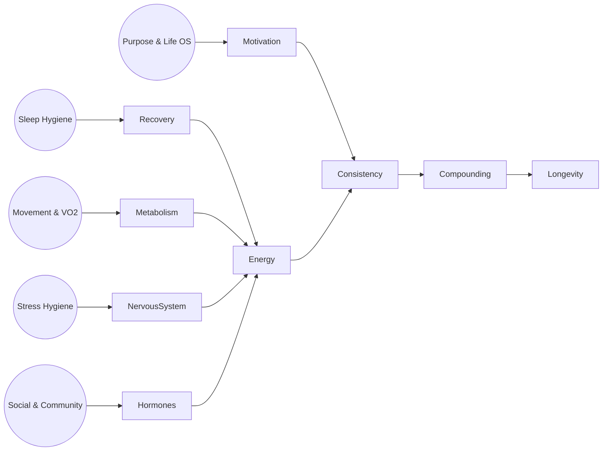

# ♾️ Longevity 101 – Sống khỏe, trẻ, lâu

> Mục tiêu: Tập trung vào 5 trụ cột (Sleep – Movement – Stress – Social – Purpose) với link sang từng module chuyên sâu đã có trong Well-being & Life OS. Xem đây như “index chiến lược” cho hành trình kéo dài tuổi thọ và tuổi trẻ sinh học.

---

## 1. Sleep – nền tảng của tuổi thọ
- **Tác động:** Thiếu ngủ kéo dài → tăng nguy cơ Alzheimer, tiểu đường type 2, bệnh tim.
- **Protocol chính:** 7-9h ngủ sâu, nhịp sinh học ổn định, ánh sáng đúng thời điểm.
- **Quick wins:**
  - Cố định bedtime/wake time ±30 phút.
  - Sunlight sáng + dim lights tối.
  - Không caffeine sau 14h.
- **Tài liệu:** [Sleep Optimization](../health/sleep-optimization.md), [Cortisol & Melatonin System](../health/cortisol-melatonin-system.md).

## 2. Movement & Cellular Renewal (Vận động & Tái tạo tế bào)
- **Tác động:** Muscle mass & VO₂ max cao → giảm 30-40% mortality. Sarcopenia (mất cơ) là kẻ thù của tuổi già.
- **Cơ chế Autophagy (Dọn rác tế bào):** Khi cơ thể thiếu hụt năng lượng tạm thời (thông qua tập luyện hoặc nhịn ăn), nó sẽ tự động kích hoạt quá trình "ăn (phagy) chính mình (auto)". Các tế bào hỏng, protein gập sai (nguyên nhân gây Alzheimer) sẽ bị tái chế thành nguyên liệu mới.
- **Protocol chính:** 
  - Vận động: Strength 2-3 buổi/tuần, Zone 2 150-180 phút/tuần.
  - Tái tạo: Kích hoạt mTor (bằng Whey Protein sau tập) để xây cơ, và kích hoạt AMPK/Autophagy (bằng Intermittent Fasting 16:8) để dọn rác cơ thể.
- **Quick wins:**
  - Fasting (Nhịn ăn gián đoạn): Ăn xong bữa tối lúc 8PM, bỏ qua bữa sáng hôm sau, ăn trưa lúc 12PM (16 tiếng không nạp calo).
  - Kết hợp micro-workout (push-up, squat) mỗi 2h.
  - Trì hoãn việc bổ sung NAD+/NMN nếu chưa làm tốt nền tảng trên (NAD+ có tăng nhờ Fasting tự nhiên).
- **Tài liệu:** [Movement Protocols](../health/movement-protocols.md), [Health Optimization Protocols](../health/health-optimization-protocols.md), [Glucose & Insulin](../health/glucose-insulin-system.md).

## 3. Stress & Nervous System
- **Tác động:** Cortisol cao mãn tính → viêm, lão hóa tế bào nhanh, rối loạn hormone.
- **Protocol chính:** Chu kỳ push-recover, Nervous system hygiene, ngủ đầy đủ.
- **Quick wins:**
  - 20 phút đi bộ thiên nhiên/ngày.
  - Breathwork (Box breathing, physiological sigh) trước/ sau work block.
  - Thi thoảng digital detox 24h.
- **Tài liệu:** [High Performance – Khi nào không nên push](./high-performance.md#5-khi-nao-khong-nen-day-high-performance), [Burnout Prevention](./mental-resilience/burnout-prevention.md), [Restore Tinh-Khi-Thần](./restore-tinh-khi-than.md).

## 4. Social & Relationships
- **Tác động:** Cô đơn kéo dài = hút 15 điếu thuốc/ngày. Lưới quan hệ chất lượng giúp giảm stress, kéo dài tuổi thọ.
- **Protocol chính:** Chăm sóc “inner circle”, xây ritual gặp gỡ, tham gia cộng đồng có mục đích chung.
- **Quick wins:**
  - Lên lịch “Deep catch-up” 1 người/tuần.
  - Chọn 1 nhóm/club để duy trì hoạt động hàng tuần.
  - Practice “3 gratitudes” cuối ngày dành cho người khác.
- **Tài liệu:** [Restore Tinh-Khi-Thần](./restore-tinh-khi-than.md), [Cultivating Yang Energy](./cultivating-yang-energy.md) – phần cộng đồng năng lượng.

## 5. Purpose & Identity
- **Tác động:** Người có ikigai/mục tiêu sống rõ ràng → sống lâu hơn, chống trầm cảm và suy giảm nhận thức.
- **Protocol chính:** Liên tục cập nhật “vì sao” trong Life OS, chuyển hóa mục tiêu dài hạn thành ritual hằng ngày.
- **Quick wins:**
  - Review Life OS mỗi quý (Alignment, Strategy, Growth engine).
  - Viết “Legacy note” 1 lần/tháng: mình muốn để lại điều gì?
  - Journaling gratitude + impact cuối tuần.
- **Tài liệu:** [Life OS / Alignment Engine](../life-os/alignment-engine.md), [Psychology of Self](../life-os/psychology-of-self.md), [Strategy Engine](../life-os/strategy-engine.md).

---

## Longevity Stack – checklist nhanh
- [ ] Ngủ đủ 7-9h, track bằng wearable.
- [ ] 10k bước/ngày + 3 buổi strength + 2 phiên Zone 2/tuần.
- [ ] Thực hành stress hygiene (thiền, thở, nghỉ deload) 5 ngày/tuần.
- [ ] Gặp 1 người thân/bạn thân mỗi tuần, tham gia cộng đồng meaningful.
- [ ] Làm monthly Life OS review: mục tiêu, ý nghĩa, hành động.

> **Tip:** Không cần theo trend “biohack” đắt đỏ. 80% lợi ích đến từ 5 trụ cột cơ bản + duy trì >5 năm.

---

## Mở rộng & tài nguyên
- [Environment & Workspace](./environment-workspace.md) – giữ “hardware” ổn định để các thói quen trên dễ thực thi.
- [Health Optimization Protocols](../health/health-optimization-protocols.md) – lịch trình sáng/tối/tuần.
- [When to Seek Help?](./when-to-seek-help.md) – dấu hiệu nên gặp bác sĩ.
- [Supplements 101](../health/supplements-101.md) – bổ trợ nếu đã khoá chặt nền tảng.

> “Longevity không phải chạy marathon trong 1 ngày, mà là chạy bền từng ngày trong cả thập kỷ.”

### 📊 Visual: Longevity Flywheel

