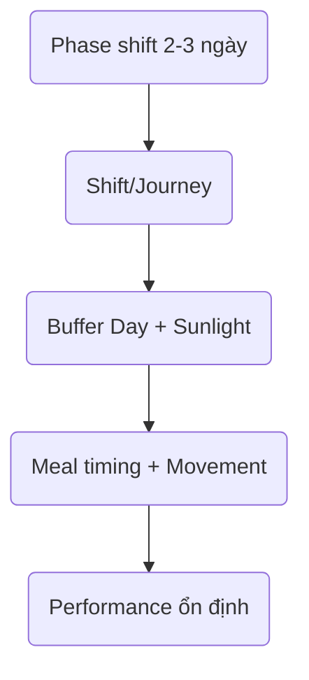

# 🌍 Shift Workers & Travel Protocols

> Nếu bạn làm ca đêm, trực bệnh viện, DevOps on-call hay phải bay xuyên múi giờ → áp dụng các bước dưới để bảo vệ nhịp sinh học, hormone và hiệu suất. Mọi công cụ chi tiết đã có ở Sleep, Cortisol, Glucose – file này là bản tóm tắt chiến thuật.

---

## 1. Chuẩn bị trước khi bay/làm ca
- **Phase shift 2-3 ngày trước:** Đi ngủ dậy sớm/muộn hơn 1h/ngày để gần với giờ mục tiêu.
- **Ánh sáng:** Dùng [Sleep Optimization](../biohacking/sleep-optimization.md) – tắm nắng/vào sáng bằng đèn mô phỏng để kéo nhịp.
- **Meal timing:** Đồng bộ bữa ăn theo giờ nơi đến ngay từ ngày lên đường → Glucose ổn định nhanh hơn.
- **Supplement:** Melatonin 0.5-3mg (theo bác sĩ) cho ca đêm cần ngủ ban ngày, magnesium để thư giãn thần kinh.

## 2. Trong chuyến bay / ca làm
- **Sleep slots:** Ca đêm → chợp mắt 90’ trước ca (nap) + 20’ giữa ca nếu có thể.
- **Ánh sáng & âm thanh:** Kính đen + earplug khi ngủ ngày; đèn sáng trắng + âm nhạc upbeat khi bắt đầu ca đêm.
- **Dining window:** Ăn 2-3 bữa trong “giờ thức” mới, tránh ăn lúc chuẩn bị ngủ để bảo vệ insulin.
- **Hydration + Electrolytes:** Máy bay/ca đêm dễ mất nước → uống 250ml/giờ, thêm điện giải nhẹ.
- **Movement:** Every 2h đứng dậy, đi bộ, làm mobility để tránh tê cơ + kích hoạt cortisol nhẹ giúp tỉnh táo.

## 3. Hồi phục sau ca/jet lag
- **Daylight exposure:** Ngay khi đến nơi mới → 10-15’ sunlight theo giờ bạn muốn thức.
- **Sleep block:** Phải ngủ ngày? Dùng combo: phòng tối + white noise fan + nhiệt độ 18-20°C + [Sleep Optimization](../biohacking/sleep-optimization.md) ritual.
- **Cortisol reset:** Thực hiện [Cortisol & Melatonin System](../biohacking/cortisol-melatonin-system.md) – sáng ra ngoài nắng, tối giảm ánh sáng xanh.
- **Glucose ổn định:** [Glucose System](../biohacking/glucose-insulin-system.md) – ăn protein/fat trước carb, đi bộ sau ăn để giảm crash khi thiếu ngủ.
- **Recovery day:** Lên lịch “buffer day” sau chuyến bay dài/chuỗi ca đêm → ưu tiên ngủ + Movement nhẹ (Zone 1-2, stretching).

## 4. Checklist nhanh
- [ ] Lập kế hoạch shift/flight và điều chỉnh ngủ trước 2-3 ngày.
- [ ] Mang sleep kit: eye mask, earplug, travel pillow, magnesium.
- [ ] Chọn thời điểm caffeine chiến lược (tránh 6h trước block ngủ).
- [ ] Giữ meal timing consistent, không ăn vặt lúc cơ thể chuẩn bị ngủ.
- [ ] Dành 1-2 ngày sau để reset với sunlight, movement nhẹ, nhiều nước.

> **Khi nào cần hỗ trợ y khoa:** Mất ngủ kéo dài >2 tuần, nhịp tim cao bất thường, chóng mặt, hoặc triệu chứng Stress/PTSD – xem [When to Seek Help?](../when-to-seek-help.md).

### 🌐 Visual: Shift & Jet Lag Timeline

```mermaid
gantt
    dateFormat  HH:mm
    title Ca đêm mẫu (22:00-06:00)
    section Chuẩn bị
    Nap 90' trước ca :done, 19:30, 01:30
    Light Boost :active, 21:00, 01:00
    section Trong ca
    Deep Work / Critical Ops :crit, 22:00, 02:00
    Meal Window 1 : 23:30, 00:30
    Micro Break + Movement : 01:30, 00:30
    Meal Window 2 : 03:00, 00:30
    section Hồi phục
    Caffeine Cutoff :milestone, 04:00, 00:00
    Blue Light Block : 05:00, 00:30
    Sleep Block (Dark Room) : 06:30, 04:00
```

