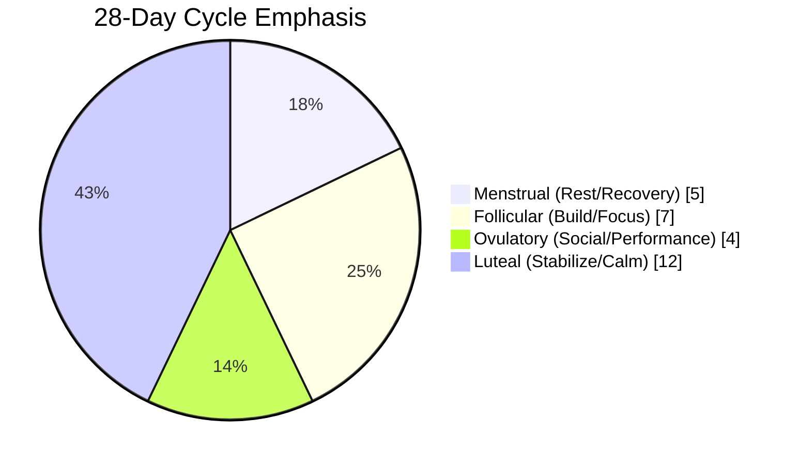
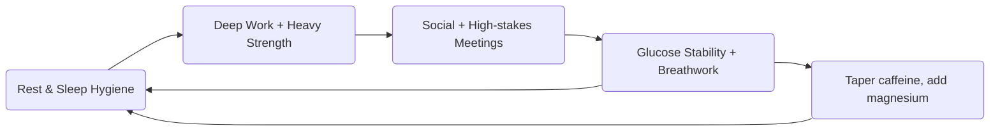

# ⚖️ Women’s Health (Cycle & Hormones)

> File tóm tắt cách tối ưu năng lượng theo chu kỳ hormone nữ. Chi tiết sinh học (Sleep, Cortisol, Glucose) đã có sẵn trong các module khác – ở đây chỉ nhắc lại trigger chính và cách phối hợp.

---

## 1. Chu kỳ 4 pha & chiến lược

| Pha | Ngày (chu kỳ 28d) | Hormone | Chiến lược chính |
| --- | --- | --- | --- |
| **Menstrual** | 1-5 | Estrogen & Progesterone thấp | Nghỉ ngơi tương đối, Zone 2 nhẹ, ưu tiên sleep hygiene & magnesium. |
| **Follicular** | 6-12 | Estrogen tăng | Energy cao → deep work, strength training nặng, carb tolerance tốt hơn. |
| **Ovulatory** | 13-16 | Estrogen đỉnh + LH surge | Social energy mạnh, pitch/meeting quan trọng, tập HIIT/ngôn ngữ dễ hơn. |
| **Luteal** | 17-28 | Progesterone cao, Estrogen giảm cuối pha | Tăng protein + healthy fat để ổn định glucose, giảm caffeine cuối pha, thêm breathwork/Restore Tinh-Khi-Thần để quản lý mood. |

- **Tool:** Track chu kỳ (Clue, Natural Cycles) → block calendar (deep work, meetings, deload) theo pha.

## 2. Liên kết hệ thống hormone

- **Sleep:** Progesterone tăng nhiệt độ → khó ngủ cuối luteal. Dùng [Sleep Optimization](../../health/sleep-optimization.md) (mát phòng, tắm nước ấm trước ngủ, magnesium glycinate 300mg).
- **Cortisol:** PMS dễ kích hoạt stress → áp dụng [Cortisol & Melatonin System](../../health/cortisol-melatonin-system.md) (morning sunlight, evening dim light, breathwork).
- **Glucose:** Nhạy cảm insulin giảm ở luteal → xem [Glucose & Insulin System](../../health/glucose-insulin-system.md) để áp dụng food sequencing + post-meal walk.
- **Dopamine:** Low motivation during menstrual? Micro wins + [Dopamine System](../../health/dopamine-system.md) ritual (digital detox nhẹ, cold exposure ngắn) giúp reset.
- **Iron:** Nếu mất máu nhiều → xét nghiệm Ferritin, bổ sung theo hướng dẫn bác sĩ.

## 3. Training & Recovery gợi ý
- **Follicular/Ovulatory:** Strength heavy (compound 3-5 reps), HIIT, PR attempts. Recovery nhanh → push dự án khó.
- **Luteal:** Switch sang hypertrophy/tempo control, Pilates, Zone 2. Tăng thời gian warm-up và mobility để bảo vệ khớp.
- **Menstrual heavy flow:** Active recovery, đi bộ, mobility nhẹ. Kết hợp [Restore Tinh-Khi-Thần](../restore-tinh-khi-than.md) để giữ tinh thần ổn định.

## 4. Checklist nhanh
- [ ] Track chu kỳ → gắn nhãn vào lịch làm việc & luyện tập.
- [ ] Điều chỉnh caffeine (ít hơn ở luteal) & bổ sung magnesium + omega-3 hỗ trợ mood.
- [ ] Meal prep giàu protein + healthy fat cuối chu kỳ để tránh craving spike.
- [ ] Kết nối cộng đồng nữ (mastermind, accountability) để tăng oxytocin, giảm stress.
- [ ] Khám định kỳ hormone, tuyến giáp nếu có dấu hiệu bất thường (mệt kéo dài, tóc rụng, chu kỳ bất thường).

> **Khi cần bác sĩ:** Chu kỳ >45 ngày, đau dữ dội phải dùng thuốc, nghi PCOS/Endometriosis → xem [When to Seek Help?](../when-to-seek-help.md).

### 🔄 Visual: Hormone Cycle Planner

