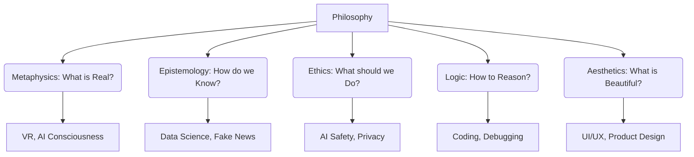

# 🌳 5 Nhánh chính của Triết học (The 5 Branches of Philosophy)

> [← Back to Philosophy Roadmap](../README.md) | [Home](../../../README.md)

Triết học quá rộng lớn. Để không bị lạc lối, bạn cần một tấm bản đồ.
Mọi câu hỏi triết học đều thuộc về 1 trong 5 nhánh chính này.

---

## 1. Metaphysics (Siêu hình học) - Nghiên cứu về Thực tại
> **Câu hỏi:** "Cái gì là thật?" (What is real?)

Đây là nền tảng của mọi thứ. Nếu bạn không biết thực tại là gì, làm sao bạn sống trong đó?

**Các chủ đề chính:**
*   **Ontology (Hữu thể học):** Sự tồn tại là gì? (Existence).
*   **Mind-Body Problem:** Ý thức (Consciousness) đến từ đâu? AI có ý thức không?
*   **Free Will vs Determinism:** Bạn có tự do lựa chọn không, hay mọi thứ đã được lập trình sẵn (bởi gen, môi trường, vũ trụ)?

**Tech Context:**
*   **Virtual Reality (VR):** Thế giới ảo có "thật" không? Nếu bạn sống trong Matrix trọn đời và hạnh phúc, có ổn không?
*   **Simulation Hypothesis:** Có khả năng vũ trụ này là một simulation của một nền văn minh cao cấp hơn (Elon Musk tin điều này).

---

## 2. Epistemology (Nhận thức luận) - Nghiên cứu về Kiến thức
> **Câu hỏi:** "Làm sao tôi biết điều tôi biết?" (How do I know what I know?)

Đây là nhánh quan trọng nhất cho Critical Thinking. Nó giúp phân biệt **Sự thật (Truth)** và **Ý kiến (Opinion)**.

**Các chủ đề chính:**
*   **Empiricism (Chủ nghĩa kinh nghiệm):** Kiến thức đến từ giác quan (Thấy mới tin). → Khoa học thực nghiệm.
*   **Rationalism (Chủ nghĩa duy lý):** Kiến thức đến từ tư duy logic (Cogito, ergo sum). → Toán học, Logic.
*   **Skepticism (Chủ nghĩa hoài nghi):** Nghi ngờ mọi thứ cho đến khi có bằng chứng không thể chối cãi.

**Tech Context:**
*   **Data Science:** Data có khách quan không? Hay cách chúng ta thu thập data đã bị bias?
*   **Fake News:** Làm sao xác minh thông tin trên internet? (Justified True Belief).

---

## 3. Ethics (Đạo đức học) - Nghiên cứu về Hành động
> **Câu hỏi:** "Tôi nên làm gì?" (What should I do?)

Không có đạo đức, con người chỉ là những con thú thông minh.

**3 Khung đạo đức chính:**
1.  **Utilitarianism (Thuyết vị lợi):** Hành động tốt nhất là hành động mang lại hạnh phúc cho nhiều người nhất. (Kết quả > Hành động).
    *   *Ví dụ:* Xe tự lái nên hy sinh 1 người để cứu 5 người.
2.  **Deontology (Thuyết nghĩa vụ - Kant):** Có những quy tắc tuyệt đối không được phạm phải, bất kể kết quả. (Hành động > Kết quả).
    *   *Ví dụ:* Không bao giờ được nói dối, kể cả để cứu người.
3.  **Virtue Ethics (Đạo đức đức hạnh - Aristotle):** Tập trung vào việc rèn luyện nhân cách (Character). Người tốt sẽ tự biết làm việc tốt.

**Tech Context:**
*   **Privacy:** Thu thập dữ liệu người dùng để cải thiện sản phẩm (Utilitarian) hay tôn trọng quyền riêng tư tuyệt đối (Deontology)?
*   **Dark Patterns:** Thiết kế UI để lừa user click quảng cáo là phi đạo đức.

---

## 4. Logic (Logic học) - Nghiên cứu về Tư duy đúng đắn
> **Câu hỏi:** "Làm sao để suy luận đúng?" (How to reason correctly?)

Logic là công cụ (tool) của triết học. Nó giúp phát hiện lỗi sai trong suy nghĩ (Fallacies).

**Các chủ đề chính:**
*   **Deduction (Diễn dịch):** Từ cái chung → cái riêng. (Mọi người đều chết → Socrates là người → Socrates sẽ chết). → Chắc chắn đúng nếu tiền đề đúng.
*   **Induction (Quy nạp):** Từ cái riêng → cái chung. (Thấy 100 con thiên nga trắng → Mọi thiên nga đều trắng). → Có thể sai (Thiên nga đen).
*   **Logical Fallacies:** Ngụy biện (Ad Hominem, Strawman, etc.).

**Tech Context:**
*   **Programming:** Code chính là Logic thuần túy (If/Else, Boolean).
*   **Debugging:** Tìm ra lỗi sai trong chuỗi logic của chương trình.

---

## 5. Aesthetics (Mỹ học) - Nghiên cứu về Cái đẹp
> **Câu hỏi:** "Cái gì là đẹp?" (What is beauty?)

Cuộc sống không chỉ là tồn tại (Metaphysics) và làm việc (Ethics), mà còn là tận hưởng (Aesthetics).

**Các chủ đề chính:**
*   **Objective vs Subjective:** Vẻ đẹp nằm ở vật thể hay trong mắt kẻ si tình?
*   **Art & Meaning:** Nghệ thuật có cần ý nghĩa không hay chỉ cần đẹp?

**Tech Context:**
*   **UI/UX Design:** Tại sao Apple lại ám ảnh với thiết kế tối giản? Vì nó chạm đến cảm xúc (Aesthetics) chứ không chỉ chức năng.
*   **Clean Code:** Code đẹp là code dễ đọc, dễ hiểu. Đó là một dạng thẩm mỹ.

---

## 🗺️ Bản đồ liên kết

---

**Next Steps:**
*   Đi sâu vào công cụ quan trọng nhất: [🧠 Critical Thinking & Logical Fallacies](./critical-thinking-basics.md).
